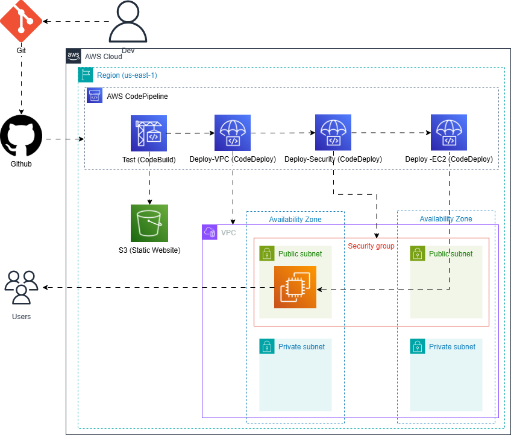
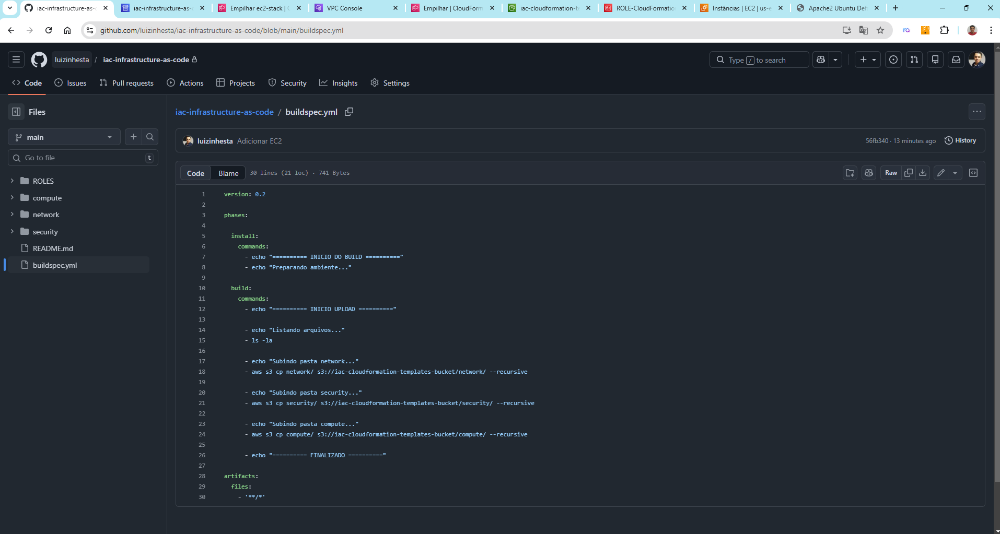
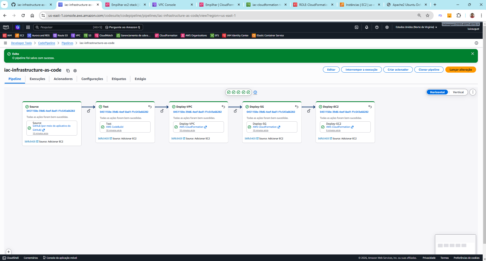
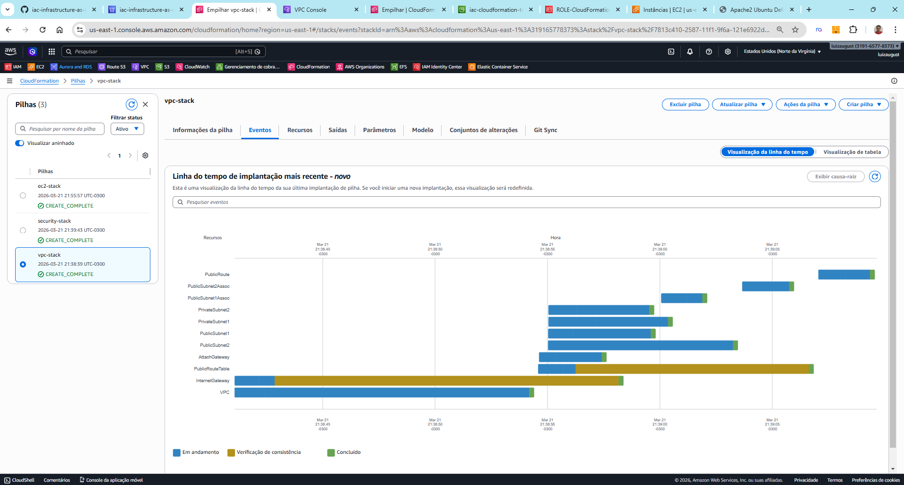
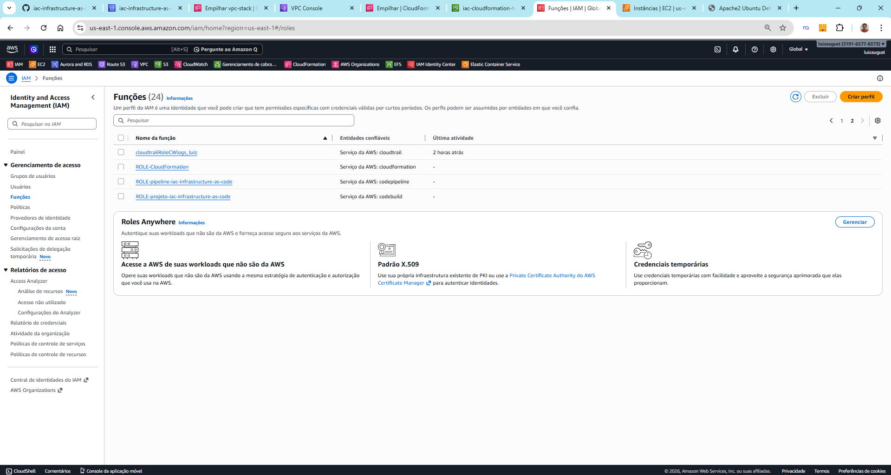
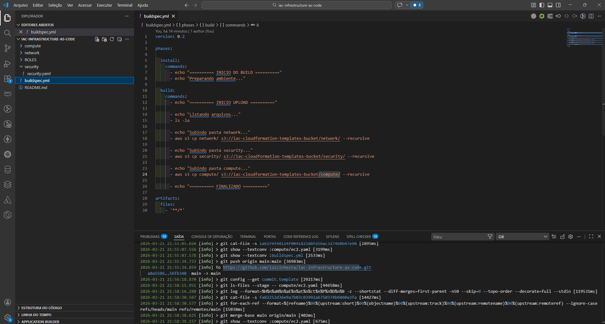
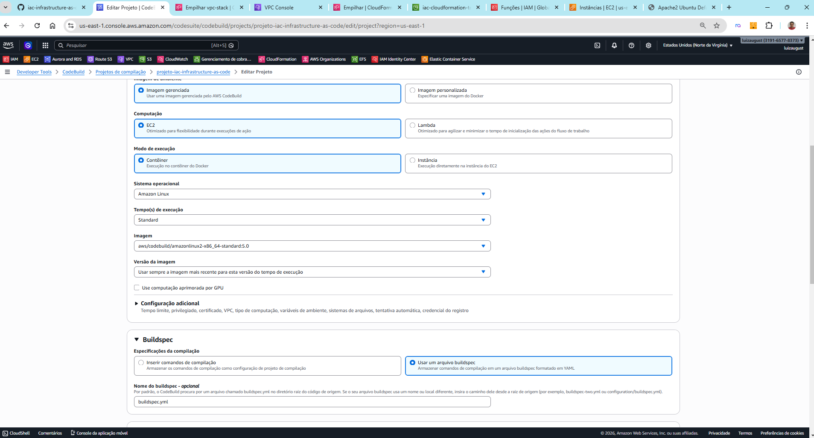
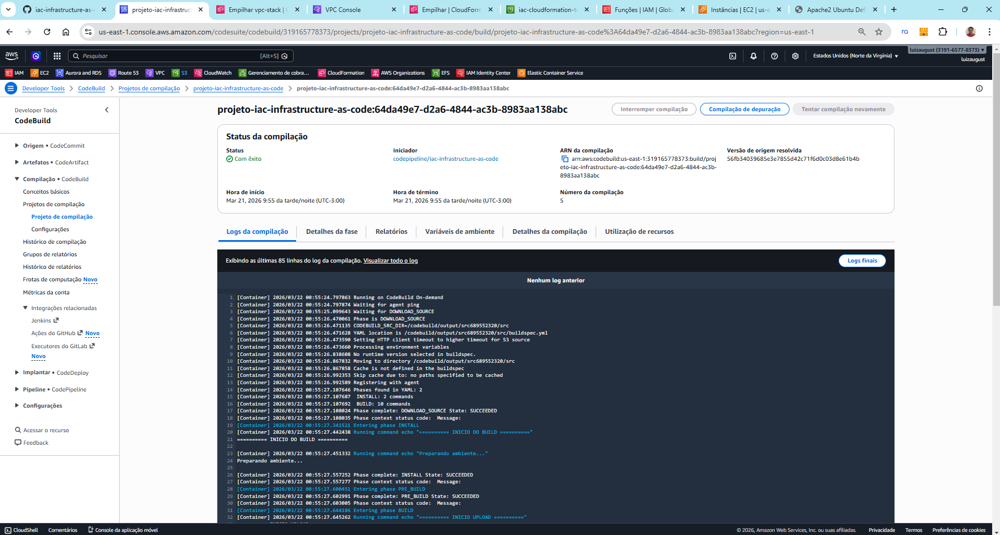
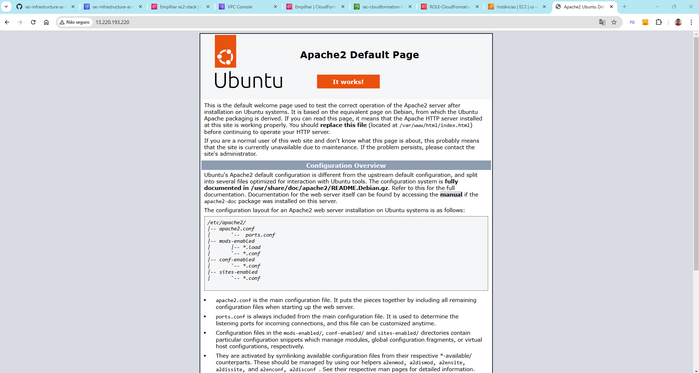

# 🚀 Projeto AWS IaC com Pipeline (CloudFormation + CodePipeline)

## 📌 Visão Geral

Este projeto demonstra na prática a criação de uma infraestrutura
completa na AWS utilizando **Infrastructure as Code (IaC)** com
**CloudFormation**, integrado a um pipeline de CI/CD com:

-   AWS CodePipeline
-   AWS CodeBuild
-   Amazon S3
-   GitHub

A proposta é automatizar o provisionamento de:

-   VPC (rede)
-   Security Group (segurança)
-   EC2 (servidor)
-   Instalação automática do Apache


.jpg)

------------------------------------------------------------------------

# 🧠 Arquitetura do Projeto

Git Local → GitHub → CodePipeline → CodeBuild → S3 → CloudFormation → VPC → Security → EC2


------------------------------------------------------------------------

# 🛠️ Tecnologias Utilizadas

-   AWS CloudFormation
-   AWS CodePipeline
-   AWS CodeBuild
-   Amazon S3
-   Amazon EC2
-   GitHub
-   YAML (IaC)
-   Linux (Ubuntu)
-   Apache Web Server

------------------------------------------------------------------------

# 📂 Estrutura do Projeto

```text
├── network/ 
│ └── vpc.yaml 
├── security/ 
│ └── security.yaml 
├──compute/ 
│ └── ec2.yaml 
├── buildspec.yml 
└── README.md
```
------------------------------------------------------------------------

# ⚙️ Funcionamento do Pipeline

1.  Código versionado no GitHub
2.  CodePipeline executa
3.  CodeBuild envia templates para o S3
4.  CloudFormation cria:
    -   VPC
    -   Security Group
    -   EC2
5.  Apache é instalado automaticamente

------------------------------------------------------------------------

# 🖼️ Imagens do Projeto

<p align="center">
  
  
  
</p>

<p align="center">
  
  
  
</p>

<p align="center">
  
  
</p>

------------------------------------------------------------------------

# 🎥 Vídeos

## YouTube

https://youtu.be/ZkzzVgJWthw

## LinkedIn

https://www.linkedin.com/in/luiz-inhesta-341b4b311/

------------------------------------------------------------------------

# 💡 Aprendizados

-   Infrastructure as Code (IaC)
-   CI/CD com AWS
-   CloudFormation (Export/Import)
-   Automação de infraestrutura

------------------------------------------------------------------------

# 👨‍💻 Autor

Luiz Augusto
